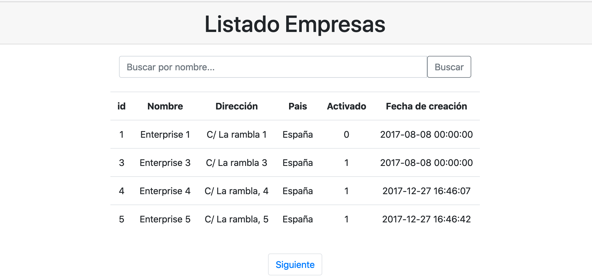

# Listado Empresas (Web APP Simple)


## Preparando el entorno

### 1. Importación de la base de datos
 El primer paso para la preparación del entorno es la importación del ``schema`` de la base de dades contenida en el [siguiente](/db_backup/crm_db.sql) script.  
La opción más fácil es volcar el contenido del fichero mediante el cliente de línea de comandos ``mysql client``, y utilizando el usuario por defecto del sistema.

```bash
    sudo mysql -u'root' < db_backup/crm_db.sql 
```

### 2. Archivo de configuración
modifica el fichero ``config/database-params.php`` indicando los parametros de conexión que has configurado para acceder a las base de datos.
```php
return [
         "host" => "127.0.0.1",
         "user" => "alecogi-web",
         "password" => "123456789",
         "database" => "crm_db"
   ];
```